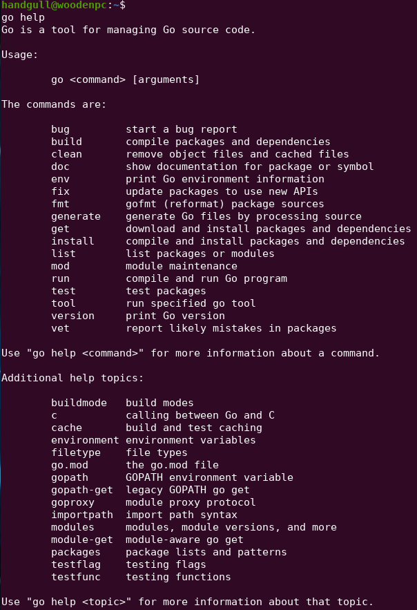
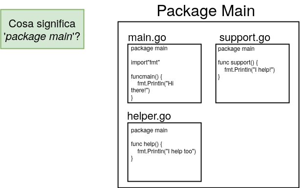

# Hello Golang
Eseguiamo il nostro primo programma:
```go
package main

import "fmt"

func main() {
	fmt.Println("Hello world")
}
```
```sh
# METODO 1
go run <program> # Compila ed esegue il programma
# METODO 2 (se si vuole tenere un file binario sulla macchina)
go build <program> # Compila il programma
./<program> # Lo eseguo (linux way)
go clean # Quando non voglio più l'eseguibile

# Comandi usati per aggiungere package sviluppati da terzi
go install
go get

go help # Panoramica della CLI per altri comandi
```



> Il comando `go fmt` formatta auomaticamente ogni file nella directory! (usato automaticamente ad ogni salvataggio dalle estensioni di [VS code](https://code.visualstudio.com/))

## Go packages
Un package, in golang, è una **collezione di codice** sorgente e può avere al suo interno il sorgente di molti files.<br>
L'appartenenza ad un package DEVE essere specificata nella prima riga di ogni file.



::: tip
Per creare un eseguibile tramite `go build` è necessario che il package si chiami `main`, altrimenti non vi sarà un file binario risultante! (invece `go run` esegue normalmente il sorgente)
:::
