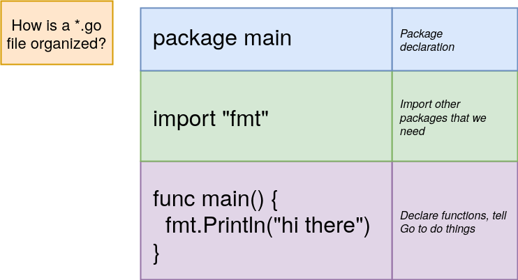

# Hello Golang
::: warning
I seguenti sono semplici appunti e non una soluzione completa di risorse, nella home sono presenti vari **approfondimenti**.<br>
Consiglio di guardare soprattutto il [Tour](https://tour.golang.org) di Go e successivamente [Golang effective_go](https://golang.org/doc/effective_go.html) e [gobyexample](http://gobyexample.com) per approfondire!<br>

Infine: per imparare a ragionare nel migliore dei modi consiglio anche di guardare i codici sorgenti dei metodi più importanti nelle documentazione
:::
Eseguiamo il nostro primo programma:
```go
package main // Specifico a quale package appartiene il sorgente (un package eseguibile in questo caso)

import "fmt" // Rende disponibile il package fmt (uno standard library package di go) al package main
// NOTA: fmt = format

func main() { // La sintassi per la dichiarazione delle funzioni è abbastanza intuitiva
	greetings := "Hello world" // Dichiarazione ed assegnamento (greetings accetta solo stringhe, vedi sotto la "tipizzazione")
	// var greetings string = "Hello world" // equivalente ma più verboso
    fmt.Println(greetings)
}
```
::: tip
Go ha una [tipizzazione forte e statica](https://it.wikipedia.org/wiki/Tipizzazione_forte), significa che il tipo di una **variabile** non può cambiare (ne a [compile-time](https://it.wikipedia.org/wiki/Compile-time), ne a [run-time](https://it.wikipedia.org/wiki/Run-time)).<br>

Unica **eccezzione** sono, come vedremo più avanti, le **interfacce vuote** che hanno tipo dinamico!
:::


::: tip
L'operatore `:=` è usato solo nell'assegnamento di **nuove variabili**.<br>

Al di fuori di una funzione però, ogni istruzione comincia con una parola chiave:<br>
(**var**, **func**, e cosí via) e quindi il costrutto `:=` non è disponibile.<br>
(e.g. `counter := 10` deve essere fatto dentro una **func**)<br>
un inizializzazione con `var` invece può essere fatta anche fuori da una funzione<br>
(e.g. `var i, j int = 1, 2`)
:::
```sh
# METODO 1
go run <file> ... # Compila ed esegue il programma (se il programma è composto da n file vanno passati n file)
# METODO 2 (se si vuole tenere un file binario sulla macchina)
go build <file> ... # Compila il programma
./<program> # Lo eseguo (linux way)
go clean # Quando non voglio più l'eseguibile

# Comandi usati per aggiungere package sviluppati da terzi
go install
go get

go help # Panoramica della CLI per altri comandi
```


> Il comando `go fmt` formatta auomaticamente ogni file nella directory! (usato automaticamente ad ogni salvataggio dalle estensioni di [VS code](https://code.visualstudio.com/))

## Valori 0
Variabili dichiarate senza un valore **iniziale** esplicito vengono inizializzate con il loro **valore zero**.<br>

Il valore zero è:
- `0` per tipi **numerici**.
- `false` per i **boolean**.
- `""` (stringa vuota) per le **stringhe**.
- `nil` per i **puntatori**, **slices**, **map** ed altri tipi.

## Le costanti
Le costanti sono dichiarate come **variabili**, ma con la parola chiave `const`.<br>
Le costanti non possono essere dichiarate con la sintassi `:=`.
```go
const Pi = 3.14
```

## Some sugar
```go
func add(x, y int) int { // Se nella dichiarazione di una funzione i parametri sono dello stesso tipo posso specificarlo 1 volta sola
	return x + y
}

// Valore di ritorno "naked"
func split(sum int) (x, y int) {
	x = sum * 4 / 9
	y = sum - x
	return // Se non specifico una return ritorna i valori di x e y, come specificato nella dichiarazione
}
```

## Go packages
Ogni programma Go è composto di packages.<br>
Un package, in golang, è una **collezione di codice** sorgente e può avere al suo interno il sorgente di molti files.<br>
L'appartenenza ad un package DEVE essere specificata nella prima riga di ogni file.


::: tip
Per creare un eseguibile tramite `go build` è necessario che il package si chiami `main` e al suo interno vi sia dichiarata una **func**(funzione) di nome main, altrimenti non vi sarà un **file binario** risultante! (invece `go run` esegue normalmente il sorgente, sempre se vi è una funzione main).<br>
Invece per avere package **riusabili** va scelto un nome diverso da `main`
:::


### Nomi pubblici
In Go, un attributo/metodo è pubblico (esportato) se comincia con una lettera maiuscola.<br>
`math.pi` -> errore `math.Pi` -> OK

### Import statements
Le import **rendono disponibili package riusabili** al package corrente.
::: tip
Documentazione degli standard library packages di go [golang.org/pkg](https://golang.org/pkg)
:::

## Struttura di un file *.go



## Array e Slice
Go ci fornisce due tipi di strutture:
1. Gli **Array**, di lunghezza **fissa**
2. Gli **Slice**, di lughezza **variabile** (la lunghezza può aumentare o diminuire)
> Nella pratica, le slice sono molto più comuni degli array.
```go
animals := []string{"dog", "cat"} // Esempio di Slice
animals = append(animals, "bird") // Aggiunta di un elemento allo Slice
animals[1] // "cat"
// COOL STUFF:
animals[0:2] // sottosequenza specificando un range {"dog, "cat"}
animals[:2] // sottosequenza che parte dal primo elemento (equivalente a sopra)
animals[1:] // sottosequenza che parte dal secondo elemento fino all'ultimo {"cat", "bird"}
animals[:] // tutto lo slice {"dog", "cat", "bird"}
// NOTA: l'index finale non è incluso

primes := [6]int{2, 3, 5, 7, 11, 13} // Esempio di array (len fissa a 6)
```
> Ogni elemento deve essere dello **stesso tipo**, e gli indici partono da 0 :ok_hand:. Questo vale per entrambe le strutture
::: tip
Quando usiamo gli Slice in realtà stiamo creando 2 strutture dati ed una di queste è un array, usato internamente dallo Slice!<br>
Lo Slice **punta** agli elementi dell'array, come vedremo più avanti nei **puntatori**.
:::


### Lunghezza e capacità
Una slice ha sia una lunghezza che una capacità.
- La **lunghezza** di una slice è il numero di elementi che essa contiene.
- La **capacità** di una slice è il numero di elementi nell'**array sottostante**, contando dal primo elemento nella slice.
> **Array a lunghezza dinamica** con **make**: [learn more](https://go-tour-ita.appspot.com/moretypes/13)

La lunghezza e la capacità di una slice s possono essere ottenute con le espressioni `len(s)` and `cap(s)`. 
## Iterazioni e cicli
Go ha solo un costrutto ciclico, il ciclo **for**. 
```go
for i, animal := range animals { // Come si usa ultimamente una possibile sintassi del for è un foreach ibrido
    fmt.Println(i, animal) // Stampa l'index dell'elemento e l'elemento, separandoli con uno spazio
}

for i := range pow { // for con range dove voglio usare solo l'index
	pow[i] = 1 << uint(i) // == 2**i
}

for i := 0; i < 10; i++ { // Sintassi del for "classico"
	sum += i
}

for ; sum < 1000; { // Si possono lasciare le istruzioni pre e post vuote, in questo caso assomiglia ad un while
	sum += sum
}
// NOTA: in quest'ultimo esempio i ; sono facoltativi

for {} // Loop
```

## Le condizioni: peculiarità
Go ci permette di dichiarare **variabili** negli if che sono usate solo all'interno del blocco `if` e dei suoi blocchi `else`
```go
if v := math.Pow(x, n); v < lim {
	return v
} else {
	fmt.Printf("%g >= %g\n", v, lim)
}
// qui v non è utilizzabile
```


::: tip
L'esempio di codice riportato nell'immagine non compilerebbe perchè `index` è una variabile che **non è usata** e go **non fa compilare!**<br>
Se non si ha intenzione di usare l'indice dell'elemento all'interno del ciclo va quindi tolta la variabile index.
:::

## Funzioni: peculiarità

### Funzioni differite (defer)
Una istruzione di defer **postpone** l'esecuzione di una funzione fino a che la funzione al suo fianco ritorna.<br>
Gli argomenti della chiamata differita sono **valutati immediatamente**, ma la **chiamata** alla funzione **non viene eseguita fino a che** la funzione al suo fianco non ritorna.<br>
Le chiamate di funzioni differite sono inserite in una **pila**. Quando una funzione ritorna, le sue chiamate differite sono eseguite nell'ordine **last-in-first-out** (LIFO)
```go
defer fmt.Print("!")
defer fmt.Print("world")
fmt.Print("hello ")
// "hello world!"
```

### Valori di ritorno multipli
In go è possibile far tornare alle funzioni più di un valore:
```go
func f1() (int, string) { // Valore di ritorno multiplo!
	return 42, "42"
}

numberVar, stringVar := f1()
// numberVar = 42; stringVar = "42"
```
> Un'altra peculiarità delle funzioni in Go è quella di avere un **receiver** (o ricevitore), concetto approfondito nel confronto con la OO tradizionale, più sotto.

## Hello Golang: esercitazione

[GO!](./exercise-cards.md)

## OO tradizionale vs Go
In Go è possibile fare OOP, ma non certo in maniera tradizionale:
- Non vi sono le classi (anche se come vedremo le **struct** hanno molte features)
- Non vi è l'**ereditarietà**, si usa solo la [composizione](https://it.wikipedia.org/wiki/Composizione_al_posto_dell%27ereditariet%C3%A0) (le interfacce sono comunque presenti ed il **Polimorfismo** è comunque ottenibile)

Per avere un idea più chiara di alcune differenze prendiamo come esempio l'esercitazione svolta:


### Tipi estesi e receiver
In go si può **estendere** un tipo base (o anche una struct, che vedremo più avanti) aggiungendo delle funzionalità, questo avviene definendo delle funzioni con un `receiver` del tipo esteso (le funzioni con receiver prendono il nome di **metodi**).
Una funzione con un receiver appartiene ad un **istanza** del tipo del receiver. (vaga somiglianza con l'approccio OO tradizionale)

::: tip
Non si può dichiarare un metodo con un ricettore il cui tipo è definito in un altro package (il che include anche tipi nativi come int)
:::


> Per altri esempi pratici sull'**implementazione** dei **custom types** basta guardare il codice dell'esercitazione linkata [sopra](./#hello-golang-esercitazione) (sono trattate anche altre cose di un certo rilievo, come i valori di ritorno multipli o i test)

