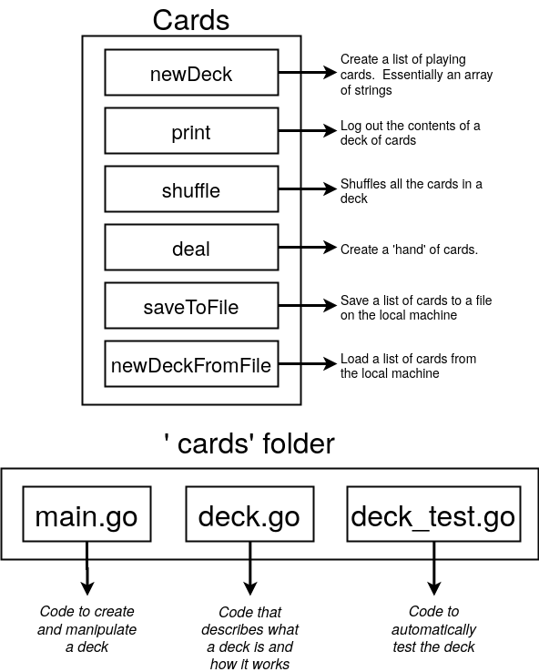

# Cards

## Struttura del progetto



## Hands-on, iniziamo a scrivere
```go
// deck.go
package main

import "fmt"

type deck []string // Per ora il custom type deck ha le stesse funzionalità di uno slice di stringhe

// Dichiarazione di una funzione di stampa che ha come receiver il custom type
func (d deck) print() { // per convenzione il receiver ha 1-3 lettere del tipo custom
	for i, card := range d { // qui al posto di d si può usare self ma è una bad practice
		fmt.Println(i, card)
	}
}
```
```go
// main.go
package main

func main() {
	cards := deck{"Ace of Diamonds", newCard()} // Posso chiamare una funzione anche prima di dichiararla
	cards = append(cards, "Six of Spades")

	cards.print() // Chiamo una funzione che ha deck come receiver
}

// Dichiaro una funzione che ritorna una stringa
func newCard() string { // Va segnato il tipo di ritorno
	return "Five of Diamonds"
}
```
