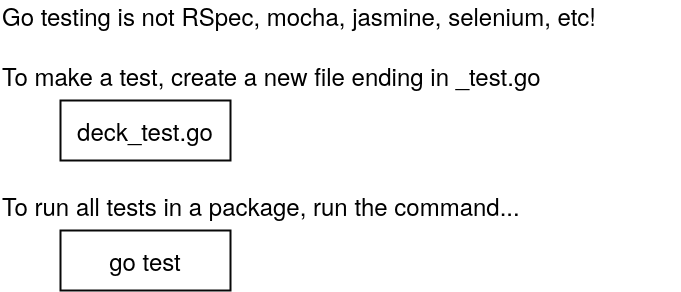
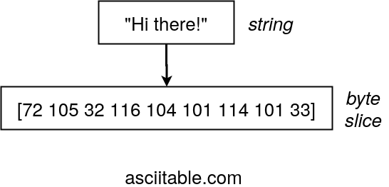
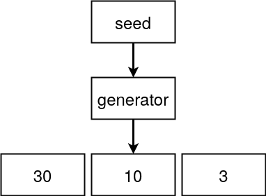

# Cards

## Struttura del progetto


## Unit testing
I test in Go differiscono molto da jasmine, selenium o qualsiasi altro framework per unit test di altri linguaggi, l'interfaccia di testing che ci offre Go è veramente un'**interfaccia di base** e scrivere test sembra quasi identico che scrivere normale codice Go



> In questa situazione Go non sa quanti test ha eseguito.

## Hands-on, iniziamo a scrivere
```go
// deck.go
package main

import (
	"fmt"
	"io/ioutil"
	"math/rand"
	"os"
	"strings"
	"time"
)

type deck []string // Per ora il custom type deck ha le stesse funzionalità di uno slice di stringhe

// Dichiaro una funzione che ritorna un deck
func newDeck() deck {
	cards := deck{}
	cardSuits := []string{"Spades", "Diamonds", "Hearts", "Clubs"}
	cardValues := []string{"Ace", "Two", "Three", "Four"}

	for _, suit := range cardSuits {
		for _, value := range cardValues {
			cards = append(cards, value+" of "+suit)
		}
	}

	return cards
}

// Dichiarazione di una funzione di stampa che ha come receiver il custom type
func (d deck) print() { // per convenzione il receiver ha 1-3 lettere del tipo custom
	for i, card := range d { // qui al posto di d si può usare self ma è una bad practice
		fmt.Println(i, card)
	}
	fmt.Println()
}

func deal(d deck, handSize int) (deck, deck) { // Valore di ritorno multiplo!
	return d[:handSize], d[handSize:]
}

func (d deck) toString() string {
	return strings.Join([]string(d), ", ") // Type convertion / cast dentro ad un metodo che fa la join delle stringhe
}

func (d deck) saveToFile(filename string) error {
	return ioutil.WriteFile(filename, []byte(d.toString()), 0666)
}

func newDeckFromFile(filename string) deck {
	bs, err := ioutil.ReadFile(filename) // Se è andato tutto a buon fine err vale 'nil'
	if err != nil {
		fmt.Println("Error:", err) // Stampo l'errore
		os.Exit(1)                 // Termino l'esecuzione con codice di errore
	}

	ss := strings.Split(string(bs), ", ")
	return deck(ss)
}

func (d deck) shuffle() {
	source := rand.NewSource(time.Now().UnixNano())
	r := rand.New(source)

	for i := range d {
		newPosition := r.Intn(len(d) - 1)
		d[i], d[newPosition] = d[newPosition], d[i] // One line swap, sintassi molto comoda
	}
}
```
```go
// main.go
package main

func main() {
	filename := "my_cards"
	cards := newDeck() // Posso chiamare una funzione anche prima di dichiararla
	cards.shuffle()
	hand, remainingCards := deal(cards, 5)

	hand.print() // Chiamo una funzione che ha deck come receiver
	remainingCards.print()

	hand.saveToFile(filename)

	fileCards := newDeckFromFile(filename)
	fileCards.print()
}
```
```go
// deck_test.go
package main

import (
	"os"
	"testing"
)

func TestNewDeck(t *testing.T) {
	d := newDeck()

	if len(d) != 16 {
		t.Errorf("Expected deck length of 16, but got %v", len(d))
	}

	if d[0] != "Ace of Spades" {
		t.Errorf("Expected first card of Ace of Spades, but got %v", d[0])
	}

	if d[len(d)-1] != "Four of Clubs" {
		t.Errorf("Expected last card of Four of Clubs, but got %v", d[len(d)-1])
	}
}

func TestSaveToDeckAndNewDeckFromFile(t *testing.T) {
	filename := "_decktesting"
	os.Remove(filename) // Ritorna un error ma lo ignoro
	d := newDeck()
	d.saveToFile(filename)

	loadedDeck := newDeckFromFile(filename)

	if len(loadedDeck) != 16 {
		t.Errorf("Expected 16 cards in deck, but got %v", len(loadedDeck))
	}
	os.Remove(filename)
}
```

## Considerazioni
> La funzione usata per salvare dei file ha come secondo parametro uno **Slice di byte**.<br>
Una stringa può essere convertita in uno Slice di byte usando il **codice ascii**.



> Se non si agisce come mostrato nell'esercitazione e nella [doc](https://golang.org/pkg/math/rand/#NewSource) di Go i numeri casuali potrebbero essere sempre uguali ad ogni esecuzione, dato che il **seed** non cambia mai:


