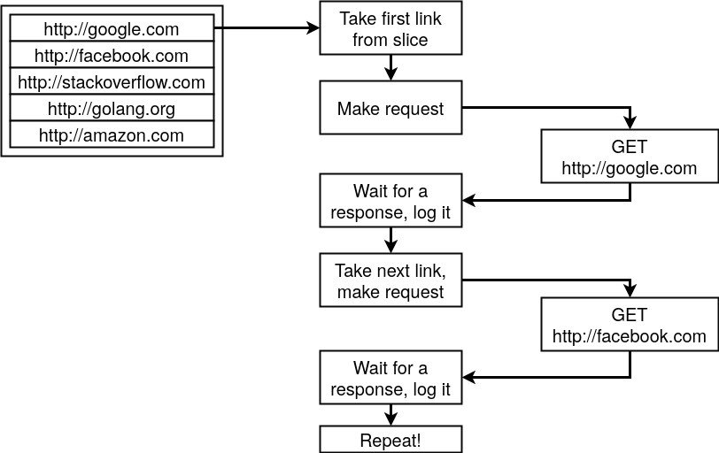
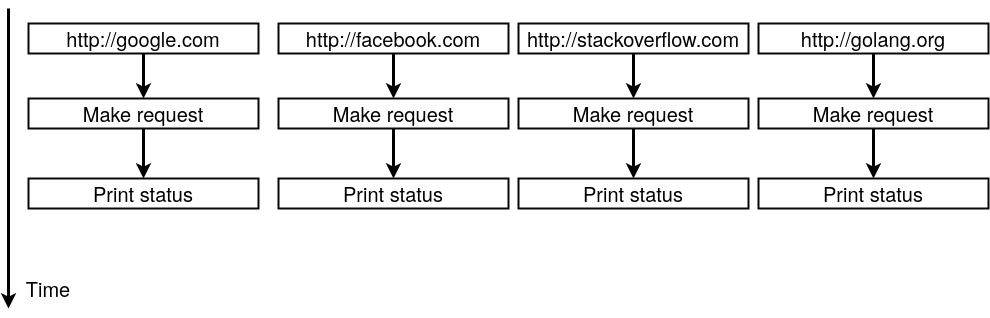
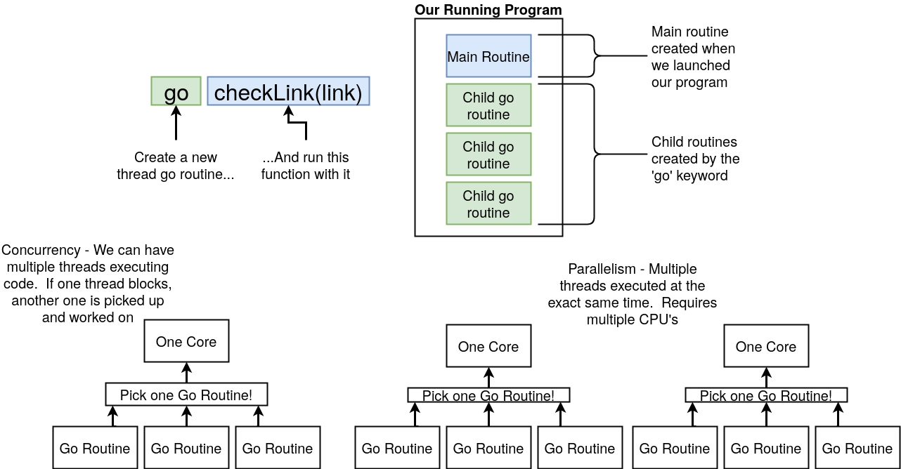
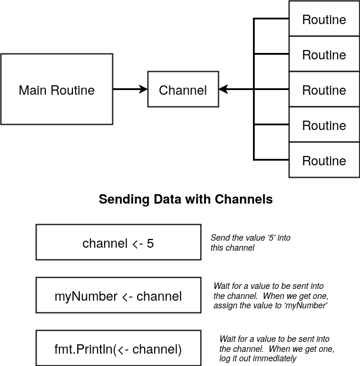
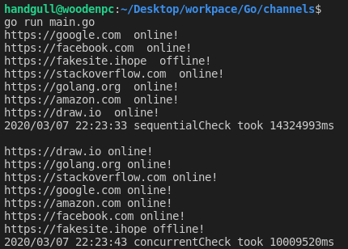
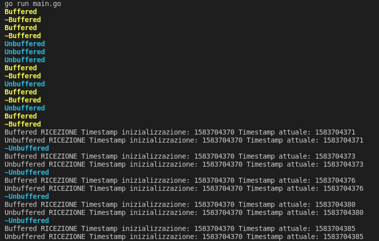

# Goroutines e Channels
Una goroutine è un thread leggero gestito dal runtime di Go. Cosa possono offrirci questi strumenti? partiamo da un esempio diretto:<br>
Vogliamo controllare lo stato di n siti (se sono raggiungibili). Senza goroutines questo viene fatto con una certa **sequenzialità**, ovvero **bisogna attendere** la risposta di ogni sito prima di testare il sito successivo.



Le **goroutines**, come del resto la programmazione [concorrente](https://it.wikipedia.org/wiki/Concorrenza_(informatica)) in generale, ci permettono di avere un approccio **parallelo**, del tipo:



::: tip
Fin ora abbiamo usato le goroutines senza saperlo, l'esecuzione di un programma infatti se non specificato diversamente è racchiusa tutta in una goroutine (**Main Go Routine**)!
:::



## Channels
La Main routine **non si cura di aspettare** che le sue child routines siano finite per terminare, per questo entrano in gioco i **channels**, che sono l'unico modo che le goroutines hanno per **comunicare**.<br>

**Ogni channel ha un tipo**, un channel di un determinato tipo è usato per un **flusso di dati** ESCLUSIVAMENTE di quel tipo (e.g. un channel di tipo int)



> Guarda anche [Select](https://go-tour-ita.appspot.com/concurrency/5)
```go
package main

import (
	"fmt"
	"log"
	"net/http"
	"time"
)

func main() {
	links := []string{
		"https://google.com",
		"https://facebook.com",
		"https://fakesite.ihope",
		"https://stackoverflow.com",
		"https://golang.org",
		"https://amazon.com",
		"https://draw.io",
	}

	sequentialCheck(links)
	fmt.Println()
	concurrentCheck(links)
}

func timeTrack(start time.Time, name string) {
	elapsed := time.Since(start)
	log.Printf("%s took %dms", name, elapsed.Nanoseconds()/1000000)
}

func sequentialCheck(links []string) {
	defer timeTrack(time.Now(), "sequentialCheck") // time.Now viene determinato subito ma la funzione grazie a defer viene chiamata solo una volta finito il for
	for _, link := range links {
		checkLink(link) // Controllo sequenziale, l'esecuzione è bloccata finchè la funzione non finisce
	}
}

func concurrentCheck(links []string) {
	c := make(chan string) // Creo un canale di comunicazione dentro cui posso passare dei valori string
	// NOTA: il channel va passato alla funzione

	for _, link := range links {
		go concurrentCheckLink(link, c) // Davvero facilissimo dire a Go di eseguire del codice in maniera concorrente!
	}
	defer timeTrack(time.Now(), "concurrentCheck")
	for i := 0; i < len(links); i++ {
		fmt.Println(<-c) // Blocco di codice bloccante che si aspetta un output da parte del canale c
	}
}

func checkLink(link string) {
	_, err := http.Get(link)
	if err != nil {
		fmt.Println(link, " offline!")
	} else {
		fmt.Println(link, " online!")
	}
}

// Funzione equivalente ma che al posto che stampare a schermo comunica all'interno di un channel
func concurrentCheckLink(link string, c chan string) {
	_, err := http.Get(link)
	if err != nil {
		c <- link + " offline!"
	} else {
		c <- link + " online!"
	}
}
```



### Close e Range su channel
Il mittente può chiudere (close) un canale per indicare che **non verranno più inviati valori**. Il destinatario può **testare** se un canale è stato chiuso assegnando un **secondo parametro** all'espressione di ricezione:
```go
v, ok := <-ch // ok vale false se il canale è chiuso

// Loop che crea una nuova routine appena viene inviato qualcosa nel canale fino ad una eventuale close
for l := range c { // dove c è un channel
    // Un modo furbo per mettere la child routine in pausa 5 secondi senza bloccare anche la main routine (e non modificare la funzione con la logica)
    go func(link string) { // Function literal o funzione anonima
        time.Sleep(5 * time.Second)
        concurrentCheckLink(link, c)
    }(l) // Passo l come istanza di link alla function literal
}

close(c) // Chiusura di un channel
```
::: tip
Le function literals sono le **funzioni anonime** di Go, una funzione anonima può essere anch'essa essere **valutata** all'interno di una **child routine** (ovvero posso anteporre `go` ad una function literal).
:::

### Channels buffered
Dando ad un canale un **buffer** noi possiamo avere una **coda** di dimensione n, finchè la coda non è piena le goroutines **possono terminare anche se il valore non è ancora stato letto** (se non hanno nient'altro da fare), in caso contrario la lettura del canale diventa **bloccante**.<br>
Di default la comunicazione sui channcels è sincronizzata; quando invii qualche valore ci deve essere un ricevitore. Altrimenti si verificherà un `fatal error: all goroutines are asleep - deadlock!`, con i canali se il buffer non è pieno questo non avviene!
```go
package main

import (
	"fmt"
	"time"
)

const buffer = 5

// alcuni ANSI colors
const (
	infoColor    = "\033[1;34m%s\033[0m"
	noticeColor  = "\033[1;36m%s\033[0m"
	warningColor = "\033[1;33m%s\033[0m"
	errorColor   = "\033[1;31m%s\033[0m"
	debugColor   = "\033[0;36m%s\033[0m"
)

func main() {
	cb := make(chan int64, buffer) // Il channel ha un buffer, ovvero una coda di valori, così anche se non ho ancora letto il valore la routine può terminare
	ch := make(chan int64)

	for i := 0; i < buffer; i++ {
		go func(index int) {
			fmt.Printf(warningColor, "Buffered\n")
			sendTime(cb)
			fmt.Printf(warningColor, "~Buffered\n") // Questo viene stampato quando la goroutine termina
		}(i)
	}

	for i := 0; i < buffer; i++ {
		go func(index int) {
			fmt.Printf(noticeColor, "Unbuffered\n")
			sendTime(ch)
			fmt.Printf(noticeColor, "~Unbuffered\n")
		}(i)
	}

	for i := 0; i < buffer; i++ {
		time.Sleep(time.Duration(i+1) * time.Second) // Sleep per non leggere subito ciò che mi arriva nei canali (se no non si vedrebbe una differenza tra i channel)
		fmt.Println("Buffered RICEZIONE Timestamp inizializzazione:", <-cb, "Timestamp attuale:", time.Now().Unix())
		fmt.Println("Unbuffered RICEZIONE Timestamp inizializzazione:", <-ch, "Timestamp attuale:", time.Now().Unix())
	}
}

func sendTime(c chan int64) {
	c <- time.Now().Unix()
}
```



## Goroutines e Channels: esercitazione
[GO!](./exercise-factorial.md)

## Mutex: mutua esclusione
Grazie a `sync.Mutex` solo una goroutine per volta può accedere a una variabile **senza conflitti**, questo concetto è detto "di mutua esclusione".<br>

[Mutex](https://go-tour-ita.appspot.com/concurrency/9) opera tramite 2 metodi:
```go
Lock
Unlock
```
