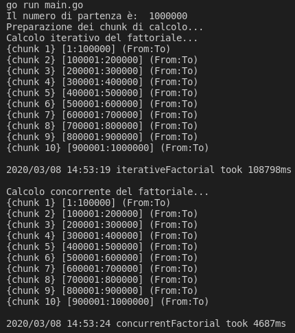

# Fattoriale iterativo vs concorrente
Di seguito la mia personale implementazione del fattoriale iterativo a confronto del fattoriale calcolato tramite goroutines!
> Provate ad implementare il vostro fattoriale prima di guardare
```go
package main

import (
	"fmt"
	"log"
	"math/big"
	"time"
)

const chunkAmount = 10 // Quanti blocchi

type chunk struct {
	from, to int // Ogni blocco di calcolo ha un valore iniziale ed uno finale
}

func (c chunk) String() string { // chunk implementa l'interfaccia Stringer
	return fmt.Sprintf("[%v:%v] (From:To)", c.from, c.to)
}

// Funzione per tracciare il tempo impiegato per eseguire le funzioni
func timeTrack(start time.Time, name string) {
	elapsed := time.Since(start)
	log.Printf("%s took %dms", name, elapsed.Nanoseconds()/1000)
	fmt.Println()
}

func main() {
	const value int = 1000000
    fmt.Println("Il numero di partenza è: ", value)
    fmt.Println("Il numero dei blocchi di calcolo (chunks) è: ", chunkAmount)
	chunks := createChunks(value)
	iterativeResult := iterativeFactorial(chunks)
	concurrentResult := concurrentFactorial(chunks)

	if iterativeResult.Cmp(concurrentResult) != 0 { // I valori risultanti dai due fattoriali dovrebbero coincidere
		fmt.Printf("Errore: %v != %v\n", iterativeResult, concurrentResult)
	}
}

func createChunks(number int) [chunkAmount]chunk {
	fmt.Println("Preparazione dei chunk di calcolo...")
	var chunks [chunkAmount]chunk
	start := 1
	var stop int // Valore iniziale = 0

	chunksLen := int(number / chunkAmount)

	for i := 0; i < chunkAmount; i++ {
		stop = start + chunksLen - 1
		chunks[i] = chunk{start, stop}
		start += chunksLen
	}
	if remainder := number % chunkAmount; remainder != 0 { // Se il numero non era perfettamente divisibile aggiungo il resto nell'ultimo chunk
		chunks[chunkAmount-1].to += remainder
	}

	return chunks
}

func iterativeFactorial(chunks [chunkAmount]chunk) *big.Int {
	defer timeTrack(time.Now(), "iterativeFactorial")
	fmt.Println("Calcolo iterativo del fattoriale...")
	result := big.NewInt(int64(1))

	for i, chunk := range chunks {
		fmt.Printf("{chunk %v} %v\n", i+1, chunk)
		for j := chunk.from; j <= chunk.to; j++ {
			result.Mul(result, big.NewInt(int64(j)))
		}
	}
	fmt.Println()

	return result
}

func concurrentFactorial(chunks [chunkAmount]chunk) *big.Int {
	defer timeTrack(time.Now(), "concurrentFactorial")
	fmt.Println("Calcolo concorrente del fattoriale...")
	result := big.NewInt(int64(1))
	channel := make(chan *big.Int)

	for i, chunk := range chunks {
		fmt.Printf("{chunk %v} %v\n", i+1, chunk)
		go concurrentChunkCalculation(chunk, channel) // Creo le child routine
	}
	for i := 0; i < chunkAmount; i++ {
		out := <-channel
		result.Mul(result, out) // Moltiplico tutti i risultati che ricevo tramite il channel
	}
	fmt.Println()

	return result
}

func concurrentChunkCalculation(c chunk, channel chan *big.Int) {
	result := big.NewInt(int64(c.from))

	for i := c.from + 1; i <= c.to; i++ {
		result.Mul(result, big.NewInt(int64(i)))
	}

	channel <- result // Invio tramite il channel il risultato finale del chunk
}
```


