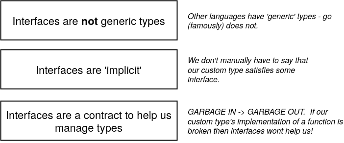

# Interfacce
::: danger
Argomento chiave
:::
Un tipo interfaccia è definito da un **insieme di metodi**.<br>

Il primo dei vantaggi da citare per quanto riguarda le interfacce è che ci permettono di usare il [Polimorfismo](https://it.wikipedia.org/wiki/Polimorfismo_(informatica)) e non è un vantaggio piccolo.<br>

Se il valore nell'interfaccia stessa è `nil`, il metodo verrà chiamato con un ricettore nil.
In alcuni linguaggi questo provocherebbe un **null pointer exception**, ma in Go è comune scrivere metodi che gestiscono elegantemente ricettori nil.<br>

[Interfacce nulle](https://go-tour-ita.appspot.com/methods/13)<br>
[Interfacce vuote](https://go-tour-ita.appspot.com/methods/14)

> Approfondimento sul polimorfismo e le sue applicazioni: [Design patterns](https://www.amazon.it/Design-patterns-Gamma/dp/887192150X/ref=sr_1_1?adgrpid=51328743303&gclid=Cj0KCQiAwP3yBRCkARIsAABGiPovYpj71M9S4XUpdib-Eeatvns18VqXqyMJADQGizl0_JQEjUT0CK8aAo2CEALw_wcB&hvadid=255202623796&hvdev=c&hvlocphy=20575&hvnetw=g&hvqmt=e&hvrand=573061937401469398&hvtargid=aud-834618287969%3Akwd-350634785967&hydadcr=18637_1737186&keywords=design+patterns&qid=1583365049&sr=8-1)<br>

Le interfacce sono dette di **tipo astratto** mentre i custom types o i base types visti fin ora sono detti **tipi concreti**, possono esistere implementazioni (o istanze) solo di un tipo concreto!



::: warning
Anche se può sembrare vantaggioso il fatto che le intefacce siano implicite a volte è **sconveniente**:<br>
ad esempio se io dimentico di implementare un metodo definito nell'interfaccia **non vengo notificato**, e se noi vogliamo che quel tipo concreto abbia una determinata interfaccia è comodo essere notificati se manca qualche funzione.
:::
> In Go un'interfaccia può essere a sua volta **composta** da più interfacce
```go
package main

import "fmt"

type bot interface { // Ho definito un interfaccia di nome bot (un tipo astratto diciamo)
	getGreeting() string // -> Qualsiasi tipo che abbia al suo interno i metodi definiti qui è da considerarsi anche di tipo bot in maniera IMPLICITA
}

type englishBot struct{}
type spanishBot struct{}

func main() {
	eb := englishBot{}
	sb := spanishBot{}
	printGreeting(eb) // Hi There!
	printGreeting(sb) // Hola!
}

func printGreeting(b bot) {
	fmt.Println(b.getGreeting())
}

func (englishBot) getGreeting() string { // TIP: se all'interno della funzione non uso il ricevitore posso omettere il nome della variabile
	return "Hi There!"
}

func (sb spanishBot) getGreeting() string {
	return "Hola!"
}
```

## Interfacce: esercitazione
[GO!](./exercise-shapes.md)

## Type assertions
```go
package main

import "fmt"

func main() {
	var i interface{} = "hello"

	s := i.(string)
	fmt.Println(s) // hello

	s, ok := i.(string)
	fmt.Println(s, ok) // hello true

	f, ok := i.(float64)
	fmt.Println(f, ok) // 0 false

	f = i.(float64) // panic
	fmt.Println(f)
}
```