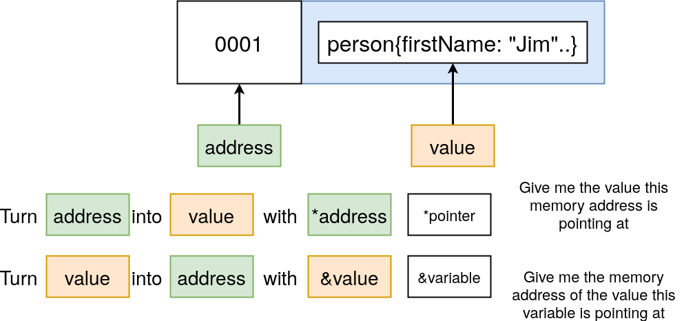
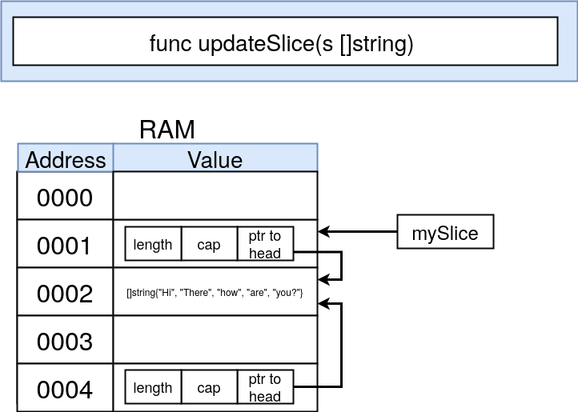
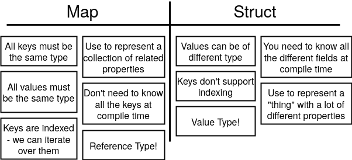

# Le Structs, i puntatori e le Maps

## Structs


> È possibile mettere una struct all'interno di un'altra struct (composizione)
```go
package main

import "fmt"

type contactInfo struct { // Custom type che estende una struct
	email   string
	zipCode int
}

type person struct {
	firstName string
	lastName  string
	contactInfo   contactInfo // Composizione (Embedded struct)
	// Nella dichiarazione appena sopra avrei potuto scrivere solo contacInfo per ottenere lo stesso risultato
}

func main() {
	// METODO 1 Assegnamento problematico se per qualche ragione inverto l'ordine delle variabili della struct
	alex := person{"Alex", "Anderson", contactInfo{
		email:   "a@a.com",
		zipCode: 28060,
	}}
	// METODO 2 (better way)
	jane := person{
		firstName: "Jane",
		lastName:  "Anderson",
		contactInfo: contactInfo{
			email:   "b@b.com",
			zipCode: 28060,
		},
	}
	// METODO 3 inizializzazione in un secondo momento
	var bob person
	bob.print() // {firstName:"" lastName:"" contactInfo:{email: zipCode:0}} (gli 0 values del tipo string/int)
	bob.firstName = "Bob"
	bob.rename("Big B")
	fmt.Println()
	fmt.Println(alex) // {Alex Anderson {a@a.com 28060}}
	fmt.Println(jane) // {Jane Anderson {b@b.com 28060}}
	fmt.Println(bob)  // {Bob "" {"" 0}} // rename non ha avuto effetto sull'istanza
}

func (p person) print() { // Stampo solo è tutto ok
	fmt.Printf("%+v", p)
}

func (p person) rename(newFirstName string) { // Qui sorge un problema: non è un passaggio per reference ma p è solo una copia del receiver (passaggio per valore)
	p.firstName = newFirstName
}
```
::: warning
In golang tutto è passato per valore!<br>
Bisogna avere ben chiara la [differenza](https://it.wikipedia.org/wiki/Parametro_(programmazione)) tra passaggio per **valore** e per **riferimento**!
:::

## Pointers
I puntatori in Go sono un po **differenti** da altri linguaggi come C ad esempio, non fornendo alcuna [aritmetica](https://it.wikipedia.org/wiki/Aritmetica_dei_puntatori) dei puntatori.<br>
Questo evita alcune **problematiche** legate ai puntatori come ad esempio andare a puntare aree di memoria che non dovrebbero essere accessibili (sotto questo aspetto i puntatori di Go sono simili alle reference di C)

Riprendendo il codice visto sopra per ottenere una **modifica effettiva** da parte della funzione `rename()` possiamo usare i puntatori:
```go{4,11}
...
	bobPointer := &bob // Conservo l'indirizzo che punta alla variabile 'bob'
	bobPointer.rename("Big B")
	bob.rename("Bobby") // Anche se il receiver si aspettava un puntatore Go in automatico accetta anche una variabile person e ne trova l'indirizzo
	fmt.Println(bob)  // {Bobby "" {"" 0}}
}

func (pp *person) rename(newFirstName string) { // Il receiver vuole un indirizzo di memoria
	(*pp).firstName = newFirstName // Con *pp accedo al valore memorizzato all'indirizzo puntato dal puntatore pp (deferenziazione esplicita)
	// NOTA: la deferenziazione esplicita non è necessaria qui!
	pp.firstName = newFirstName // Equivalente alla riga sopra
}
```

::: tip
La modifica effettiva dei dati in una funzione non è il solo motivo che può spingerci ad usare i puntatori:<br>
con i puntatori si **evita di copiare** il valore per ogni chiamata al metodo. Questo può essere più **efficiente** se la struttura puntata ha grandi dimensioni.
:::

### Chiarezza su * e &
- L'operatore `&` genera un **puntatore** verso il suo operando. 
- L'operatore `*` denota il **valore** sottostante al puntatore. Questo è conosciuto come "**dereferenziazione**" o "**indirecting**".



::: warning
Quando però **specifico il tipo** di una variabile (in una dichiarazione, come receiver o come parametro di una func) *<type\> indica la tipologia della variabile, **non sto chiedendo un valore** in corrispondenza di una cella di memoria!
:::

### Shortcut
Le funzioni con un **argomento** puntatore devono usare un **puntatore**, mentre metodi con **ricettori** puntatori possono usare **sia una valore che un puntatore**!

> A volte (come ad esempio per accedere ad un campo di una struttura) la **dereferenziazione esplicita** con `*` non è necessaria, come visto nello snippet sopra.

### Gotchas dei puntatori in Go
**Gotcha** = caratteristica peculiare del linguaggio, ovvero un comportamento che **differisce** da quello che ci si aspetterebbe.<br>

Alcune strutture in Go usano i puntatori e l'**impressione** è che esse siano passate per reference:


In realtà tutto è passato per valore, ma se si passa per **valore** un puntatore l'indirizzo **a cui punterà la copia** del puntatore sarà il medesimo:
```go
package main

import "fmt"

func main() {
	name := "bill"

	namePointer := &name

	fmt.Println(&namePointer) // Indirizzo 1
	printPointer(namePointer) // Inidirizzo 2 e indirizzo 1 != indirizzo 2
}

func printPointer(namePointer *string) {
	fmt.Println(&namePointer)
}
```

#### Slices passate per valore
Provando a passare una variabile di tipo Slice o che estende il tipo Slice (come nell'esercitazione passata) **per valore** ci si accorge che il valore degli elementi è **effettivamente modificato**!<br>
Questo perchè la copia dello Slice **copia anche il puntatore** all'array ed esso punta allo **stesso array** (o più precisamente all'inizio dell'array)



## Maps
Le Map di Go hanno la struttura **chiave : valore**, come molte altre strutture di molti altri linguaggi:
- Gli **Hash** di Ruby
- Gli oggetti di Javascript
- Le **Dict** di Python
- Le **Dictionary** di C#
- Ecc...

Come gli **Array** e gli **Slice** le **Map** supportano l'**indexing**, ovvero gli elementi sono indicizzati, questo è vantagioso per **selezionare** rapidamente un elemento o per **iterare** sugli elementi.
> Nelle map di Go ogni Key deve avere lo **stesso tipo**, e lo stesso discorso vale per i Value



```go
package main

import "fmt"

func main() {
	// METODO 1
	colors1 := map[string]string{ // Dichiaro ed inizializzo una map con le keys di tipo string e i values di tipo string
		"red":   "#ff0",
		"green": "0f0",
	}
	// METODO 2 (se si aggiunge un campo va in errore)
	var colors2 map[int]string // Dichiaro una map vuota
	// METODO 3
	colors3 := make(map[string]string)

	red := colors1["red"] // Recupero il valore dell'elemento con indice "red"
	elem, ok := colors1["black"] // Testo se una chiave è presente con una assegnamento a due valori
	// NOTA: se key è nella map ok vale true, false altrimenti (in questo caso ok = false)

	fmt.Println(colors1) // map[green:0f0 red:#ff0]
	fmt.Println(colors2) // map[]
	fmt.Println(colors3) // map[]

	colors2[42] = "#424242"   // panic: assignment to entry in nil map
	colors3["black"] = "#000" // Inserimento/aggiunta di un campo

	delete(colors1, "red") // Rimozione di un campo
}
```
### Scorrere le map (iterando)
```go
func printMap(m map[string]string) { // Come parametro mi aspetto una map con keys e values di tipo string
	for key, value := range m { // Ciclo uguale a quello di uno Slice, solo che key non è sempre un int
		fmt.Println(key + ": " + value)
	}
}
```

## Funzioni anonime e funzioni Closures
Le funzioni sono anche valori. Esse possono essere passate da una funzione all'altra come altri valori.<br>

Le **funzioni anonime** possono anche essere usate come argomenti in una funzione e ritornare valori.<br>

Le funzioni Go possono essere **closures**. Una closure è un valore **funzione che referenzia variabili al di fuori del suo corpo**. La funzione può accedere e assegnare le variabili referenziate; in questo senso la funzione è "**legata**" alle variabili.
```go
package main

import (
	"fmt"
	"math"
)

func compute(fn func(float64, float64) float64) float64 { // Mi aspetto come parametro una funzione che vuole 2 float e ritorna un float
	return fn(2, 4)
}

func adder() func(int) int { // Esempio di funzione Closure
	sum := 0
	return func(x int) int {
		sum += x
		return sum
	}
}

func main() {
	// FUNZIONI ANONIME
	hypot := func(x, y float64) float64 { // Esempio di funzione anonima
		return math.Sqrt(x*x + y*y)
	}
	fmt.Println(hypot(5, 12))      // 13
	fmt.Println(compute(hypot))    // 4.47213595499958
	fmt.Println(compute(math.Pow)) // 16
	// FUNZIONI CLOSURES
	pos, neg := adder(), adder()
	for i := 0; i < 10; i++ { // Ad ogni esecuzione chiamo adder dentro a pos e neg tenendo salvato lo stato della variabile sum
		fmt.Println(
			pos(i), // sum += i
			neg(-2*i),
		)
	}

	fmt.Println(neg(0)) // -90
}
```
