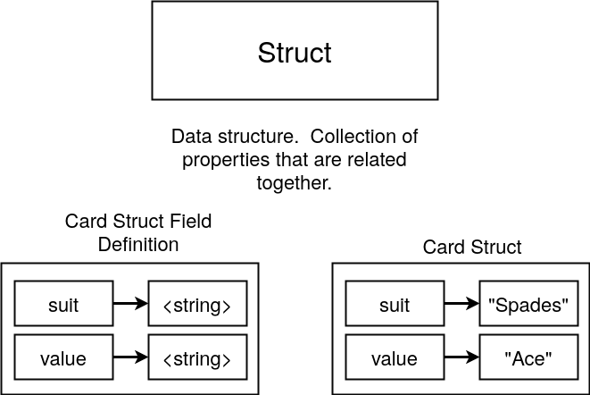
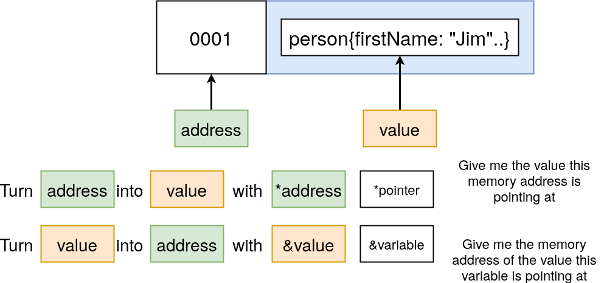
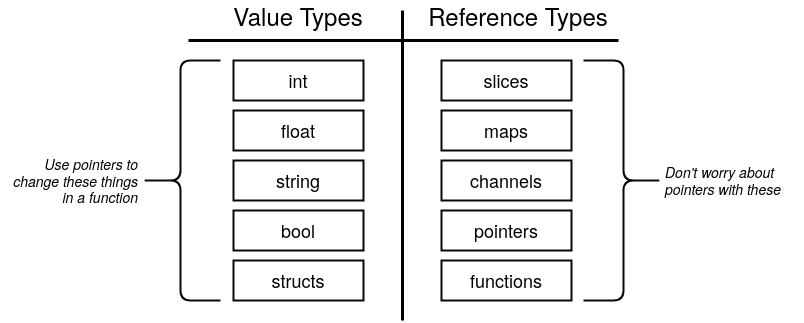
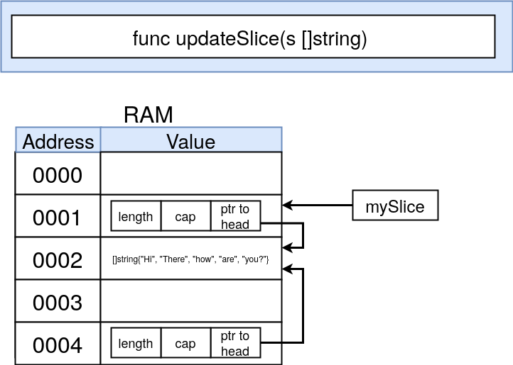

# Le Structs ed i puntatori

## Structs



> È possibile mettere una struct all'interno di un'altra struct (composizione)
```go
package main

import "fmt"

type contactInfo struct { // Custom type che estende una struct
	email   string
	zipCode int
}

type person struct {
	firstName string
	lastName  string
	contactInfo   contactInfo // Composizione (Embedded struct)
	// Nella dichiarazione appena sopra avrei potuto scrivere solo contacInfo per ottenere lo stesso risultato
}

func main() {
	// METODO 1 Assegnamento problematico se per qualche ragione inverto l'ordine delle variabili della struct
	alex := person{"Alex", "Anderson", contactInfo{
		email:   "a@a.com",
		zipCode: 28060,
	}}
	// METODO 2 (better way)
	jane := person{
		firstName: "Jane",
		lastName:  "Anderson",
		contactInfo: contactInfo{
			email:   "b@b.com",
			zipCode: 28060,
		},
	}
	// METODO 3 inizializzazione in un secondo momento
	var bob person
	bob.print() // {firstName:"" lastName:"" contactInfo:{email: zipCode:0}} (gli 0 values del tipo string/int)
	bob.firstName = "Bob"
	bob.rename("Big B")
	fmt.Println()
	fmt.Println(alex) // {Alex Anderson {a@a.com 28060}}
	fmt.Println(jane) // {Jane Anderson {b@b.com 28060}}
	fmt.Println(bob)  // {Bob "" {"" 0}} // rename non ha avuto effetto sull'istanza
}

func (p person) print() { // Stampo solo è tutto ok
	fmt.Printf("%+v", p)
}

func (p person) rename(newFirstName string) { // Qui sorge un problema: non è un passaggio per reference ma p è solo una copia del receiver (passaggio per valore)
	p.firstName = newFirstName
}
```
::: warning
In golang tutto è passato per valore!<br>
Bisogna avere ben chiara la [differenza](https://it.wikipedia.org/wiki/Parametro_(programmazione)) tra passaggio per **valore** e per **riferimento**!
:::

## Pointers
I puntatori in Go sono un po **differenti** da altri linguaggi come C ad esempio, non fornendo alcuna [aritmetica](https://it.wikipedia.org/wiki/Aritmetica_dei_puntatori) dei puntatori.<br>
Questo evita alcune **problematiche** legate ai puntatori come ad esempio andare a puntare aree di memoria che non dovrebbero essere accessibili (sotto questo aspetto i puntatori di Go sono simili alle reference di C)

Riprendendo il codice visto sopra per ottenere una **modifica effettiva** da parte della funzione `rename()` possiamo usare i puntatori:
```go
...
	bobPointer := &bob // Conservo l'indirizzo che punta alla variabile 'bob'
	bobPointer.rename("Big B")
	bob.rename("Bobby") // Anche se il receiver si aspettava un puntatore Go in automatico accetta anche una variabile person e ne trova l'indirizzo
	fmt.Println(bob)  // {Bobby "" {"" 0}}
}

func (pp *person) rename(newFirstName string) { // Il receiver vuole un indirizzo di memoria
	(*pp).firstName = newFirstName // Con *pp accedo al valore memorizzato all'indirizzo puntato dal puntatore pp (deferenziazione esplicita)
	// NOTA: la deferenziazione esplicita non è necessaria qui!
	pp.firstName = newFirstName // Equivalente alla riga sopra
}
```

### Chiarezza su * e &
- L'operatore `&` genera un **puntatore** verso il suo operando. 
- L'operatore `*` denota il **valore** sottostante al puntatore. Questo è conosciuto come "**dereferenziazione**" o "**indirecting**".

> A volte (come ad esempio per accedere ad un campo di una struttura) la **dereferenziazione esplicita** con `*` non è necessaria, come visto nello snippet sopra.



::: warning
Quando però **specifico il tipo** di una variabile (in una dichiarazione, come receiver o come parametro di una func) *<type\> indica la tipologia della variabile, **non sto chiedendo un valore** in corrispondenza di una cella di memoria!
:::

### Shortcut
Come visto nello snippet di codice sopra Go converte **automaticamente** un valore in un puntatore a quel valore se lo ritiene necessario.

### Gotchas dei puntatori in Go
**Gotcha** = caratteristica peculiare del linguaggio, ovvero un comportamento che **differisce** da quello che ci si aspetterebbe.<br>

Alcune strutture in Go usano i puntatori e l'**impressione** è che esse siano passate per reference:



In realtà tutto è passato per valore, ma se si passa per **valore** un puntatore l'indirizzo **a cui punterà la copia** del puntatore sarà il medesimo:
```go
package main

import "fmt"

func main() {
	name := "bill"

	namePointer := &name

	fmt.Println(&namePointer) // Indirizzo 1
	printPointer(namePointer) // Inidirizzo 2 e indirizzo 1 != indirizzo 2
}

func printPointer(namePointer *string) {
	fmt.Println(&namePointer)
}
```

#### Slices passate per valore
Provando a passare una variabile di tipo Slice o che estende il tipo Slice (come nell'esercitazione passata) **per valore** ci si accorge che il valore degli elementi è **effettivamente modificato**!<br>
Questo perchè la copia dello Slice **copia anche il puntatore** all'array ed esso punta allo **stesso array** (o più precisamente all'inizio dell'array)


